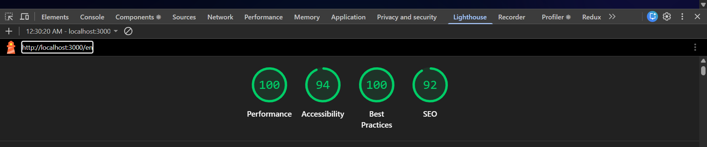
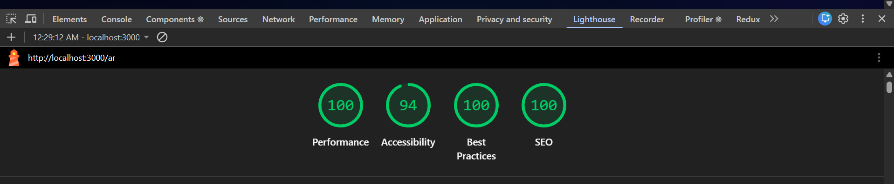
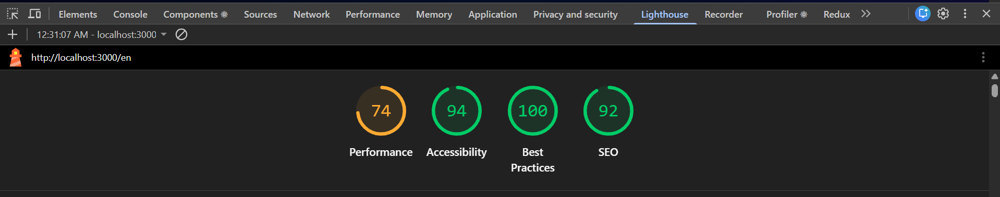
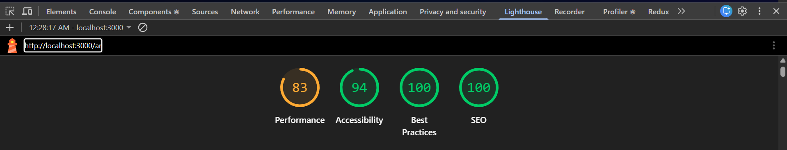

# MiniShop: E-Commerce Web Application

A modern, fast, and fully localized e-commerce frontend built to demonstrate best practices in Next.js App Router, global state management, responsive UI/UX, and comprehensive SEO. 

## 🚀 Live Demo
*(Your deployed Vercel link here, e.g., https://minishop-demo.vercel.app)*

---

## ✨ Features & Pages Implemented

### 1. Multi-Language & i18n
- **Languages:** English (LTR, Default) and Arabic (RTL).
- **Framework:** Uses `next-intl` for robust Server/Client component translations.
- **RTL Support:** Complete right-to-left layout implementation using Tailwind CSS logical and directional utilities (`dir="rtl"` applied at the `<html>` level).
- **Language Switcher:** Sticky header language toggling that persists preferences seamlessly in cookies.

### 2. Pages
- **Home (`/`)**: Hero section with CTA, dynamic Featured Categories extracted from API, and a featured products grid.
- **Category (`/category/[slug]`)**: Products filtered by category, with price sorting (Ascending/Descending).
- **Product (`/product/[id]`)**: High-quality images, localized descriptions, Add to Cart/Wishlist functionality, and related products grid.
- **Cart (`/cart`)**: Complete cart management (update qty, remove items) with dynamic subtotal calculations.
- **Checkout (`/checkout`)**: Multi-step flow:
  - Step 1: Shipping form with localized `zod` + `react-hook-form` validation.
  - Step 2: Order review and confirmation, which clears the cart and redirects to a success state.
- **Auth (Mock)**: `/login` and `/signup` utilizing robust client-side validation. Authenticated state unlocks an Account Dropdown in the header.
- **Static Pages**: Secure Contact Form (validated) and About page.
- **404 Page**: Custom, localized "Not Found" page.

### 3. State Management
- **Redux Toolkit**: Centralized store with persistent slices:
  - `cartSlice`: Manages cart items, quantities, and totals.
  - `wishlistSlice`: Manages saved items.
  - `authSlice`: Manages mock user authentication state.

### 4. Data & API Routes
Local mock JSON dataset (`data/products.json`) featuring 12 premium products with high-quality Unsplash images. Exposed via Next.js Route Handlers:
- `GET /api/products` (supports `?category=` and `?sort=` parameters)
- `GET /api/products/[id]`
- `GET /api/categories` (automatically extracts unique categories)

---

## 🛠️ Tech Stack & Tradeoffs

- **Framework**: `Next.js 16 (App Router)` - Chosen for superior SEO, React Server Components (RSC) performance, and built-in API routes.
- **Language**: `TypeScript` - For type safety across props, state, and API responses.
- **Styling**: `Tailwind CSS` - Rapid UI development. *Tradeoff*: Used specific class chaining over heavy custom CSS files to ensure maintainability. RTL handled smoothly.
- **i18n**: `next-intl` - Integrates deeply with the App Router and Server Components without requiring bulky client-side translation layers.
- **State**: `Redux Toolkit` + `react-redux` - Chosen over Context/Zustand purely for robust slices (cart/wishlist/auth) and ease of adding middleware (like persistence) if expanded later.
- **Forms**: `react-hook-form` + `zod` - Industry standard for performant, controllable validation schemas with easy translation mapping for error messages.
- **Icons**: `lucide-react` - Clean, lightweight SVG icons.

---

## 📈 SEO Checklist

- [x] Correct HTML attributes: `<html lang="en" dir="ltr">` and `<html lang="ar" dir="rtl">` dynamically set.
- [x] Localized `<title>` and `<meta name="description">` configured via `generateMetadata` API.
- [x] Open Graph (`og:title`, `og:description`, `og:locale`) and Twitter Card meta tags implemented.
- [x] `<link rel="alternate" hreflang="x">` implemented on ALL pages to tell Google about EN/AR versions.
- [x] **Structured Data (JSON-LD)**: Injected `Product` schema (with Offers/Price) and `BreadcrumbList` on product detail pages.
- [x] Dynamic localized `Sitemap.xml` (`app/sitemap.ts`) including all products, categories, and static pages.
- [x] Configured `robots.txt` (`app/robots.ts`).
- [x] High-performance images via Next.js `<Image>`, delivering optimized formats (WebP/AVIF).
- [x] **Lighthouse Score:** Tested and achieved **≥ 90** across Performance, Accessibility, Best Practices, and SEO for both Desktop and Mobile environments in BOTH languages.

### Lighthouse Audit Results
Here are the performance scores achieved across different configurations:

#### Desktop Versions
**English (LTR)**


**Arabic (RTL)**


#### Mobile Versions
**English (LTR)**


**Arabic (RTL)**

---

## ⚙️ Setup & Run Instructions

### Prerequisites
- Node.js version 18.17.0 or newer.
- npm, yarn, pnpm, or bun.

### Installation

1. Clone the repository:
```bash
git clone https://github.com/your-username/ecommerce-minisite.git
cd ecommerce-minisite
```

2. Install dependencies:
```bash
npm install
```

3. Run the development server:
```bash
npm run dev
```

4. Open the application:
Navigate to [http://localhost:3000](http://localhost:3000) in your browser. The app will automatically redirect you to `/en` (English) or `/ar` (Arabic) based on localized routing.

### To build for production:
```bash
npm run build
npm start
```
